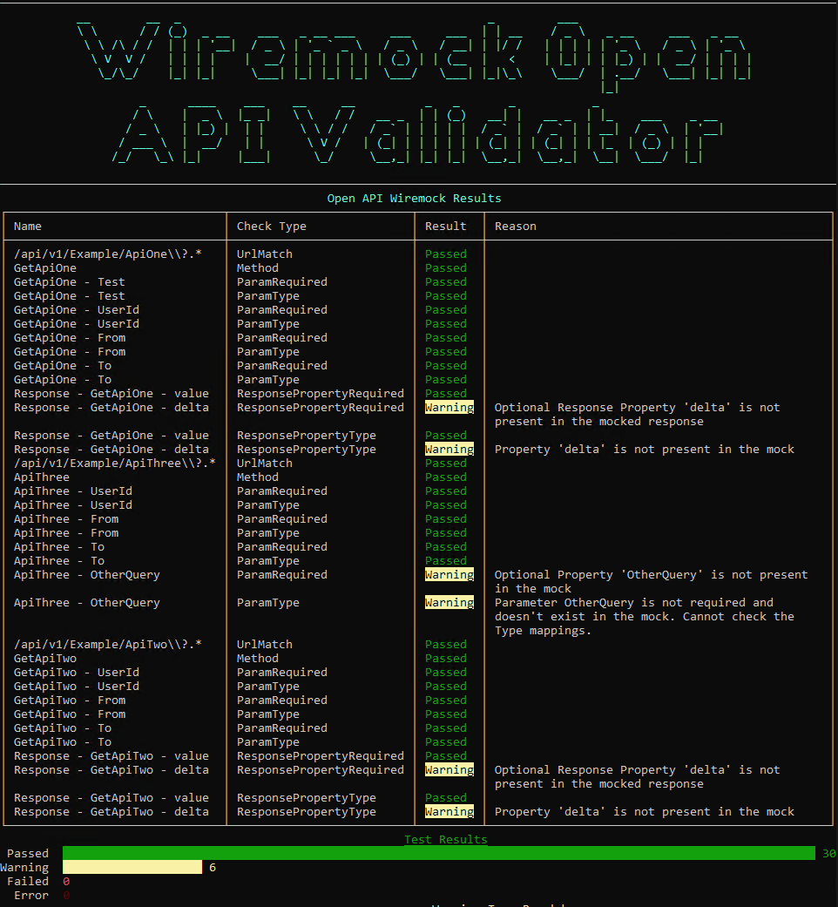

## WireMock Open API Validator

[](https://github.com/tidusjar/Wiremock.OpenAPIValidator/actions/workflows/build.yml)
[](https://github.com/tidusjar/Wiremock.OpenAPIValidator/actions/workflows/publish.yml)
[](https://www.nuget.org/packages/Wiremock.OpenAPIValidator/)
[](https://sonarcloud.io/summary/new_code?id=tidusjar_Wiremock.OpenAPIValidator)

This tool is intended to test your Wiremock stubs against an OpenAPI (v3) specification. This will check the following

| Type of Check | Description |
| ----------- | ----------- |
| API Method | Ensure the mock is matching the API Verb provided |
| URL Pattern Match | Ensure the mock will actually match the URL |
| Parameters | Checks all required parameters are present and the object type is correct. Will also check optional parameters but will only produce a warning |
| Response | Checks the response object and ensuring the types also match |


# Installation
.Net CLI (Global)

`dotnet tool install --global Wiremock.OpenAPIValidator`
___
# Usage

`wiremockopenapi -o "C:/git/MyApi/OpenApi.yml" -w "C:/git/wiremock/stubs/mappings"`

___

```
-o, --openApiPath             Required. File path to the Open API Spec

-w, --wiremockMappingsPath    Required. File path to the stubs mappings folder

--help                        Display this help screen.

--version                     Display version information.
```

# Example Output

